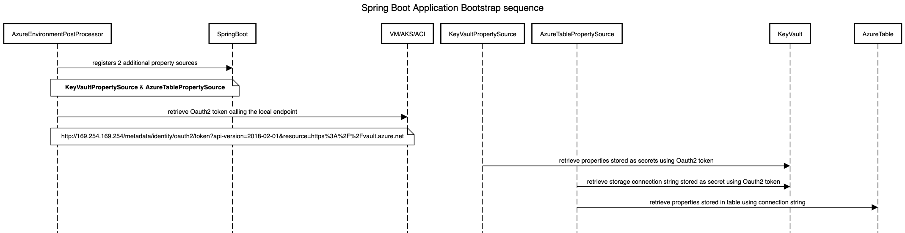
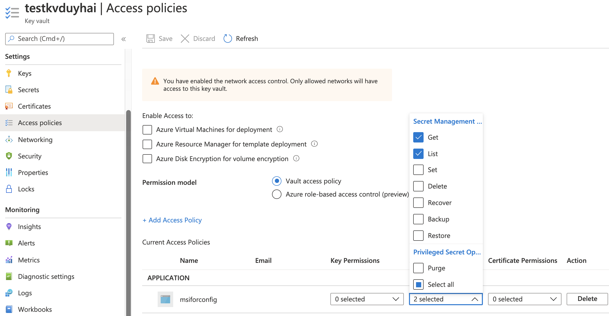
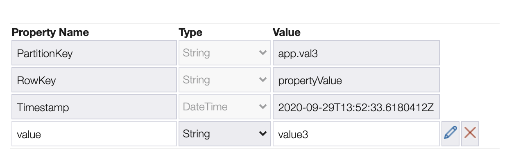
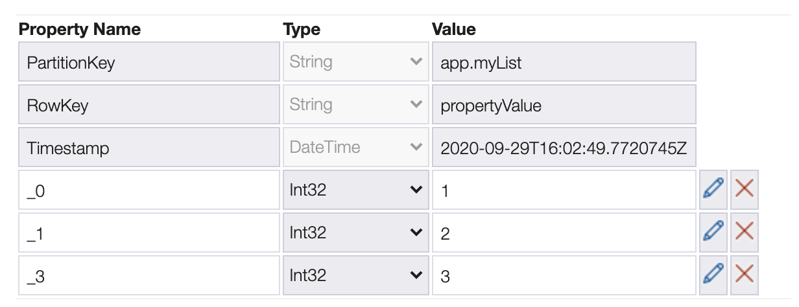
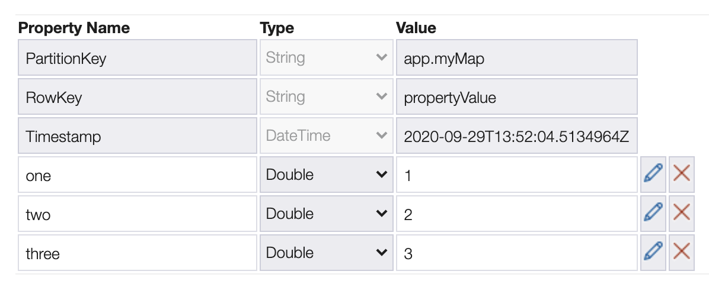
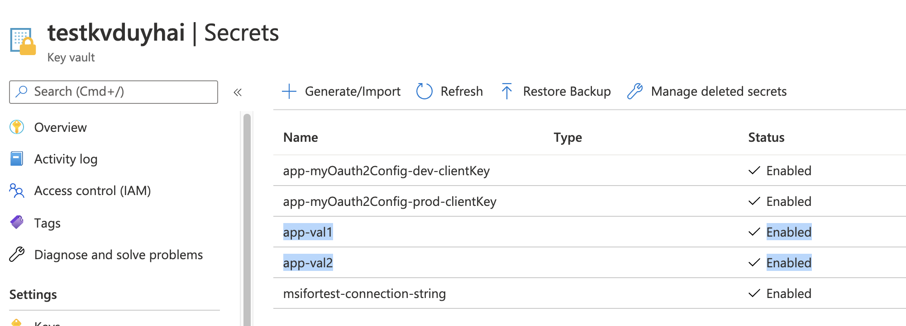
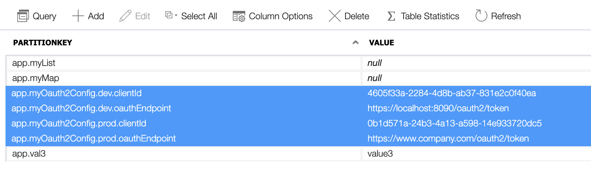
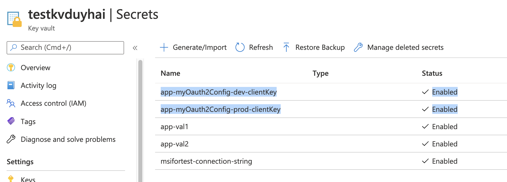

Azure Spring Boot Config
===

# A. Overview

This library allows any Spring Boot application to retrieve its properties from Azure Key Vault and/or Azure Storage table. The advantage of this library is that is does not require any authentication secret or password (**passwordless properties retrieval**). Rather, the library retrieves at **runtime** all necessary credentials to access the key vault/azure tables using Azure Managed Identity

Consequently, the clear pre-requisites are:

1. you have to deploy the Spring Boot application on either Azure Container Instances(ACI), VMs or Azure Kubernetes Service (AKS)
2. you have to configure correct **Access Policy** on the key vault to the MSI assigned to your VMs, AKS or ACI

> Note: this library is inspired by https://github.com/Azure/azure-sdk-for-java/tree/master/sdk/spring/azure-spring-boot/src/main/java/com/microsoft/azure/keyvault/spring but it does not support multiple key vault and adds the support for Azure table. Also this library only support authentication using MSI which is the most secured way to retrieve secrets in Azure

# B. Concept

To implement this feature, the library declares a custom **`AzureEnvironmentPostProcessor`** to Spring Boot that takes care of the retrieval of all properties stored in an Azure key vault or Azure table

Below is the sequence diagram showing the bootstrap of an application



Because the authentication mechanism for Azure table only accepts connection string or shared access signature, it is not possible to access it using an access token. Therefore you need to store the connection string of the storage account as a special secret in the key vault

# C. Dependencies

The library is using the following dependencies:

- com.azure:azure-security-keyvault-secrets: 4.2.1
- com.azure:azure-identity: 1.1.2
- com.microsoft.azure:azure-storage: 8.0.0
- org.apache.commons:commons-lang3: 3.10
- com.fasterxml.jackson.core:jackson-core: 2.11.2
- com.fasterxml.jackson.core:jackson-databind: 2.11.2
- org.springframework.boot:spring-boot: 2.3.4.RELEASE
- org.springframework.boot:spring-boot-autoconfigure: 2.3.4.RELEASE
- org.springframework.boot:spring-boot-configuration-processor: 2.3.4.RELEASE
- org.slf4j:slf4j-api: 1.7.28

 
# D. How to use

To use this library:

1. Checkout this repository
2. Build it locally with `mvn clean install`
3. Import it as a Maven dependency in your project with
    ```xml
    <dependency>
        <groupId>com.doanduyhai</groupId>
        <artifactId>azure-springboot-config</artifactId>
        <version>1.0</version>
    </dependency>
    ```
4. Create a Key Vault in Azure to store your secrets
5. Create an **User Assigned Managed Identity** in Azure
6. Go to your key vault, menu "Access Policy" and assign the **Get** and **List** permission on secrets to your MSI

    

7. If your want to store non-secret properties in an Azure table

    a. Create a new Storage Account on Azure
    
    b. Create a table to store your non-secret properties

    b. Go to the menu "Access Key" and retrieve one of the 2 available **Connection string**

    c. Go back to your Key Vault and add the following secret:

        1. Secret name = `<storage_account_name>-connection-string`
        2. Secret value = the above Connection string 

8. In your **`application.yaml`** file, add the following section

    ```yaml
     azure:
       keyvault:
         enabled: true
         uri: https://<your_keyvault_name>.vault.azure.net/
       table:
         enabled: true
         storage-account-name: <your_storage_account_name>
         table-name: <your_table_name>
    ```

9. To store secret properties into the key vault, since the secret name pattern is restricted to `[a-zA-Z0-9-]`, the dot (`.`) is not allowed. Consequently the property `xxx.yyy.zzz` should be converted to `xxx-yyy-zzz`

10. To store non-secret properties in the Azure table, you should respect some conventions

    a. For simple properties:
        
        1. Partition key = property name
        2. Row key = **propertyValue** string
        3. Column name = **value**, column value = property value 

    

    b. For collection (list) properties
    
        1. Partition key = property name
        2. Row key = **propertyValue** string
        3. Column name = **_index** = index in the list, column value = collection value at the given index

    
    
    c. For map properties
    
        1. Partition key = property name
        2. Row key = **propertyValue** string
        3. Column name = map key, column value = map value
        
    
                  
# E. Examples 

You can find a sample application in the folder `src/test/java`. For this sample application, the `application.yaml` is:

```yaml
azure:
  keyvault:
    enabled: true
    uri: https://testkvduyhai.vault.azure.net/
  table:
    enabled: true
    storage-account-name: msifortest
    table-name: BackendConfig

app:
  val1:
  val2:
  val3:
  myList:
  myMap:
  myOauth2Config:
    dev:
      oauthEndpoint:
      clientId:
      clientKey:
    prod:
      oauthEndpoint:
      clientId:
      clientKey:
```

For `app.val1` and `app.val2`, we decide to store the properties in the key vault:



Please note that in the same key vault, we store the connection string for the storage account **`msifortest`** in the secret name **`msifortest-connection-string`**

For `app.val3`, `app.myList` and `app.myMap`, we store the properties in the Azure table

_app.val3_


_app.myList_


_app.myMap_


The property `app.myOath2Config` is more complex. It is indeed represented in the source code as `Map<String, Oauth2Config>` with the class `Oauth2Config` defined as:

```java
public class Oauth2Config {
    private String oauthEndpoint;
    private String clientId;
    private String clientKey;
    
    // Getters & Setters
}        
```

Indeed, the `app.myOath2Config` complex property can be flattened to :

- `app.myOath2Config.dev.oauthEndpoint`
- `app.myOath2Config.dev.clientId`
- `app.myOath2Config.dev.clientKey`
- `app.myOath2Config.prod.oauthEndpoint`
- `app.myOath2Config.prod.clientId`
- `app.myOath2Config.prod.clientKey`

Because the `oauthEndpoint` and `clientId` are not sensitive information, we can decide to store them in an Azure table as simple properties



But for `clientKey` property, we must securely store it in the Key Vault



With the above example, we illustrate the usage combination of Key Vault and Azure table to handle complex properties

# F. Sample application

There is a sample application to illustrate how the library works in the `src/main/test` folder

 